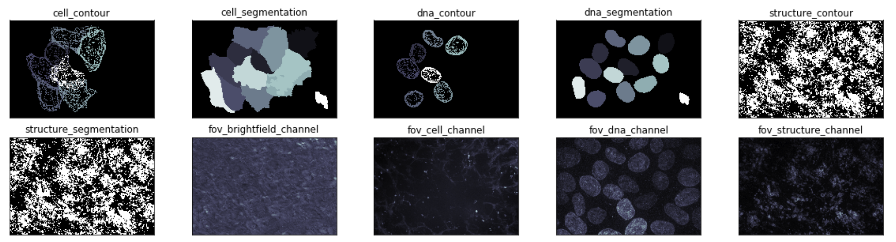

# Allen Institute for Cell Science Pipeline Integrated Cell
**Maintainer:** Jackson Maxfield Brown (jacksonb@alleninstitute.org)

**Overview:** This package contains single-cell data for most of the cells seen, imaged, measured, and
cataloged by the [Allen Institute for Cell Science](https://www.allencell.org) Pipeline: Integrated Cell.

**Package Feedback:** Feedback on benefits and issues you discovered while using this data package is greatly
appreciated. [Feedback Form](https://forms.gle/GUBC3zU5kuA8wyS17)

### Index
1. [Introduction](#introduction)
2. [Contents](#contents)
3. [Usage](#usage)

## Introduction
Much of the data gathered by the Allen Institute for Cell Science has previously been released as zipped or tarred
batches of files hosted on our website. This repository provides the same high quality, curated datasets of labeled
cell lines, but through Quilt's loading mechanism.



## Contents
Our images are of endogenously-tagged hiPSC, grown for 4 days on Matrigel-coated 96-well, glass bottom imaging plates.
Each field of view (FOV) includes 4 channels (BF, EGFP, DNA, Cell membrane) collected either interwoven with one
camera (workflow Pipeline 4.0 - 4.2) or simultaneously with two cameras (Workflow Pipeline 4.4). You can use the file
metadata of each image to target the specific channel you are interested in. FOVs were either selected randomly (mode
A), enriched for mitotic events (mode B) or sampling 3 different areas of a colony (edge, ridge, center) using a
photo-protective cocktail (mode C). The images cataloged in this dataset come in several flavors:

* Field of view images
* Membrane contour images
* Membrane segmentation images
* DNA contour images
* DNA segmentation images
* Structure contour images
* Structure segmentation images

The full details of the Allen Institute cell workflow are available on our website [here](https://www.allencell.org/methods-for-cells-in-the-lab.html).

The full details of the Allen Institute microscopy workflow are available on our website [here](https://www.allencell.org/methods-for-microscopy.html).

## Usage
We understand this package is quite large and may not fit on your machine. Here is our list of methods for interacting
with this package that work well for us and alleviate the package size burden. If you would like a deeper understanding
of what all you can do with Quilt, please refer to their [documentation](https://docs.quiltdata.com).

To load the package:
```python
import quilt3

pkg = quilt3.Package.browse("aics/pipeline_integrated_cell", registry="s3://allencell")
pkg
```

You should see something like this:
```
(remote Package)
└─README.md
└─dna_contours/
└─dna_segmentations/
└─fovs/
└─membrane_contours/
  └─027e05d1_2338186cd44447f2b4c47d4bfd1a3e6c
  └─02b6da4f_efd7cd116a004b7598d91970e234abaa
  └─0834b1cc_7fe021c5dc994547a084c5c1ed9b9c2b
  └─09d98c76_539fb56c22bc40f8a77692996f134f47
  └─0fb0bc1b_51f587b5ccfa4c768973671e856d1662
  └─0feb8e3d_326e3d78d16f4ee9b55b6d7a95346d4b
  └─102c54e7_60fc062decb549a68c36e23a83fed881
  └─19b5f428_7a2079a7029a4117a80693765db857e3
  └─19df5ee5_28b95a9339a14b888e2e74ed76e1e357
  └─19fe90d6_2f7e67039e3442479db94c80217a01a0
  └─1b830961_1b98934f715341218e3d2d6d34092fac
└─membrane_segmentations/
└─metadata.csv
└─referenced_files/
└─structure_contours/
└─structure_segmentations/
...
```

*Note: If you want to retrieve a prior or specific version of this package you can add a `top_hash` parameter to the
`browse` function like so:*
```python
specific_version = quilt3.Package.browse(
    "aics/pipeline_integrated_cell",
    "s3://allencell",
    "7a03086e6efa58d80ade4b2563b76053ef3e901654656b99cd9d7c1e5313f87c"
)
```

*You can find the top hashes for packages on the [Allen Cell Quilt data catalog](https://open.quiltdata.com/b/allencell/packages/aics/pipeline_integrated_cell).*

You can use this `pkg` (`quilt3.Package`) object to navigate around the dataset using dictionary accessors like so:
```python
example_membrane_contour = pkg["membrane_contours"]["027e05d1_2338186cd44447f2b4c47d4bfd1a3e6c"]
```

To then download that file locally you can use the `fetch` function like so:
```python
example_membrane_contour = example_membrane_contour.fetch("/path/to/my/target/destination.json")
```

Quilt may not natively know how to deserialize the file. In which case, you can pass a bytes reading function or object
to the `PackageEntry` object as a parameter to have the file read like so:
```python
from aicsimageio import AICSImage
example_membrane_contour_loaded = example_membrane_contour(AICSImage)
```

All of the core files (any file not in the top level or the `reference_files` directories) will have metadata attached
that you can use as a method for determining if that may be a file that interests you. Access the metadata for any of
these files by using the `meta` attribute like so:
```python
example_meta = example_membrane_contour.meta
example_meta
```

You should see something like this:
```json
{
    "CellId": [43, 45],
    "CellIndex": [2, 4],
    "CellLine": "AICS-22",
    "NucMembSegmentationAlgorithm": "Matlab nucleus/membrane segmentation",
    "NucMembSegmentationAlgorithmVersion": "1.3.0",
    "FOVId": 7682,
    "Gene": "LAMP1",
    "PlateId": "3500001454",
    "WellId": 67156,
    "ProteinDisplayName": "LAMP-1",
    "StructureDisplayName": "Lysosome",
    "Workflow": "Pipeline 4.1",
    "associates": {
        "membrane_contours": "membrane_contours/027e05d1_2338186cd44447f2b4c47d4bfd1a3e6c",
        "membrane_segmentations": "membrane_segmentations/b464c2b6_eb3d9586717a41f585aba1bfe3489bf8",
        "dna_contours": "dna_contours/b9503445_e2ff11632d2e4db181647dd2b6fcf9f5",
        "dna_segmentations": "dna_segmentations/85db2bb0_50ecb0fd3f4947d8bb11c5009a37edd8",
        "fovs": "fovs/d6516b6a_ad8175a14fda40cd92f70fed127db607",
        "structure_contours": "structure_contours/9a897c11_e4515b89a0ae4decaf8f64e2c58659ef",
        "structure_segmentations": "structure_segmentations/658fc926_e52f870d6b6240a0b176de627083461b"
    }
}
```

Notice the `associates` block in the metadata; Anything in this block is a quick reference to related files. In our
example above we can tell from the metadata that we are looking at the membrane contour file for FOVId: 7682.
If we wanted to navigate to the dna contour image for this same FOV we can use this associates block like so:
```python
example_dna_contour = pkg[example_meta["associates"]["dna_contours"]]
```

You can also filter down the entire `pkg` contents to what you think you are looking for by using `pkg.filter`. If we
wanted to find all files from plate `"3500001806"`, we could write a filtering function like so:
```python
def filter_by_plate_id(lk, entry) -> bool:
    # Check if the key 'PlateId' is present in the file meta
    # It won't be present for standard files like the README and metadata csv
    if "PlateId" in entry.meta:
        # If it is, return based on plate id match
        return entry.meta["PlateId"] == "3500001806"
    return False

sub_pkg = pkg.filter(filter_by_plate_id)
```

For more details on how filtering works please see
[the Quilt documentation on the subject](https://docs.quiltdata.com/advanced-usage/filtering-a-package).

*Note: If you are more comfortable with pandas dataframes, you can also use traditional dataframe filtering options on
the metadata.csv file.*


### Distribution
This package was created and distributed using
[Quilt3Distribute](https://github.com/AllenCellModeling/quilt3distribute).
