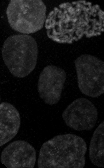
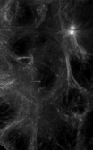
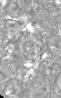

# Allen Institute for Cell Science Pipeline Integrated Single Cell
**Maintainers:** Greg Johnson (gregj@alleninstitute.org), Jackson Maxfield Brown (jacksonb@alleninstitute.org)

**Overview:** This is a **BETA** companion package for the complete Allen Institute for Cell Science Pipeline
Integrated Cell Collection. This package contains single-cell data for most of the cells seen, imaged, measured, and
cataloged by the [Allen Institute for Cell Science](https://www.allencell.org) Pipeline: Integrated (Single) Cell.

**Package Feedback:** Feedback on benefits and issues you discovered while using this data package is greatly
appreciated. [Feedback Form](https://forms.gle/GUBC3zU5kuA8wyS17)

### Index
1. [Introduction](#introduction)
2. [Contents](#contents)
3. [Usage](#usage)

## Introduction
Much of the data gathered by the Allen Institute for Cell Science has previously been released as zipped or tarred
batches of files hosted on our website. This repository provides the same high quality, curated datasets of labeled
cell lines, but through Quilt's loading mechanism.


## Contents
This package contains preprocessed single cell images and features. From the complete collection we contrast-adjust
each field by setting the within-cell median pixel intensity for each field and channel to the minimum pixel value and
set the 99.98% brightest pixel to the maximum pixel value. Each cell is oriented by the major axis of the cell shape,
and translated such that the nuclear region is in the center of the image. All images are cropped to the same size such
that 95% of the cells fit within the image region.

The following is provided for each cell:
* Cell Id
* Metadata (Cell line, Labeled protein name, segmented region index, gene, etc.)
* 3D cell and nuclear segmentation, and, DNA, membrane, and structure channels
* 2D max projects for dimension pairs (XY, ZX, and ZY) of the above 3D images
* A whole bunch of features for each cell

For the 3D images the channel ordering is:

0. Segmented DNA
1. Segmented Membrane
2. DNA (Hoechst)
3. Membrane (CellMask)
4. Labeled Structure (GFP)
5. Transmitted Light

| Segmented DNA                                                                                                                                                          | Segmented Membrane                                                                                                                                                          | DNA (Hoechst)                                                                                                                                                | Membrane (CellMask)                                                                                                                                               | Labeled Structure (GFP)                                                                                                                                                    | Transmitted Light                                                                                                                                                              |
|------------------------------------------------------------------------------------------------------------------------------------------------------------------------|-----------------------------------------------------------------------------------------------------------------------------------------------------------------------------|--------------------------------------------------------------------------------------------------------------------------------------------------------------|-------------------------------------------------------------------------------------------------------------------------------------------------------------------|----------------------------------------------------------------------------------------------------------------------------------------------------------------------------|--------------------------------------------------------------------------------------------------------------------------------------------------------------------------------|
|  |  |  |  |  |  |

Also contained are contact sheets for each sub-cellular structure.

The full details of the Allen Institute cell workflow are available on our website [here](https://www.allencell.org/methods-for-cells-in-the-lab.html).

The full details of the Allen Institute microscopy workflow are available on our website [here](https://www.allencell.org/methods-for-microscopy.html).

## Usage
We understand this package is quite large and may not fit on your machine. Here is our list of methods for interacting
with this package that work well for us and alleviate the package size burden. If you would like a deeper understanding
of what all you can do with Quilt, please refer to their [documentation](https://docs.quiltdata.com).

To load the package:
```python
import quilt3

pkg = quilt3.Package.browse("aics/pipeline_integrated_single_cell", registry="s3://quilt-aics")
pkg
```

You should see something like this:
```
(remote Package)
└─README.md
 └─cell_features/
   └─0001ff07_13736_116816_feats.json
   └─00027332_7359_45319_feats.json
   └─00071828_16827_11409_feats.json
   └─00082e1b_43663_130491_feats.json
   └─000857a2_13878_117592_feats.json
   └─000a787c_13764_116907_feats.json
   └─000b0e81_5956_40157_feats.json
   └─000ba89f_16970_7249_feats.json
   └─000ca0ca_15037_128823_feats.json
   └─000dcb13_4623_34166_feats.json
   └─000fb968_6619_44763_feats.json
   └─0011638f_5260_32584_feats.json
   └─0012fc30_1952_75327_feats.json
   └─001455d2_43674_130710_feats.json
 └─cell_images_2d/
 └─cell_images_2d_projections/
 └─cell_images_3d/
 └─metadata.csv
 └─referenced_files/
 ...
```

*Note: If you want to retrieve a prior or specific version of this package you can add a `top_hash` parameter to the
`browse` function like so:*
```python
specific_version = quilt3.Package.browse("aics/pipeline_integrated_single_cell", "s3://quilt-aics", "7cf876498abb12db5004fbf7dbaece9fd1ca0b2e68738280f126c85f86a0b628")
```

*You can find the top hashes for packages on the [Allen Cell Quilt data catalog](https://allencell.quiltdata.com/b/quilt-aics/packages/aics/pipeline_integrated_single_cell).*

You can use this `pkg` (`quilt3.Package`) object to navigate around the dataset using dictionary accessors like so:
```python
example_feats = pkg["cell_features"]["0001ff07_13736_116816_feats.json"]
```

To then download that file locally you can use the `fetch` function like so:
```python
example_feats = example_feats.fetch("/path/to/my/target/destination.json")
```

For certain file formats, Quilt natively knows how to deserialize the file and you can load the contents like so:
```python
example_feats_loaded = example_feats()
```

For other file formats, Quilt may not natively know how to deserialize the file. In which case, you can pass a bytes
reading function or object to the `PackageEntry` object as a parameter to have the file read like so:
```python
from aicsimageio import AICSImage
example_image_loaded = pkg["cell_images_3d"]["00001bb5_16872_35317_reg.tiff"](AICSImage)
```

All of the core files (any file not in the top level or the `reference_files` directories) will have metadata attached
that you can use as a method for determining if that may be a file that interests you. Access the metadata for any of
these files by using the `meta` attribute like so:
```python
example_meta = example_feats.meta
example_meta
```

You should see something like this:
```json
{
    "CellId": 105772,
    "CellIndex": 7,
    "CellLine": "AICS-53",
    "NucMembSegmentationAlgorithm": "Matlab nucleus/membrane segmentation",
    "NucMembSegmentationAlgorithmVersion": "1.3.1",
    "FOVId": 10416,
    "Gene": "GJA1",
    "PlateId": "3500001806",
    "WellId": 116885,
    "ProteinDisplayName": "Connexin-43",
    "StructureDisplayName": "Gap junctions",
    "Workflow": "Pipeline 4.2",
    "associates": {
        "save_feats_path": "cell_features/00034a00_10416_105772_feats.json",
        "save_reg_path": "cell_images_3d/7b9befb5_10416_105772_reg.tiff",
        "save_reg_path_flat": "cell_images_2d/23982d4d_10416_105772_reg_flat.png",
        "save_reg_path_flat_proj": "cell_images_2d_projections/7d53366a_10416_105772_reg_flat_proj.png"
    }
}
```

Notice the `associates` block in the metadata; Anything in this block is a quick reference to related files. In our
example above we can tell from the metadata that we are looking at the features file for Cell Id: 105772.
If we wanted to navigate to the 3d cell image for this same cell we can use this associates block like so:
```python
example_cell_3d = pkg[example_meta["associates"]["cell_images_3d"]]
```

You can also filter down the entire `pkg` contents to what you think you are looking for by using `pkg.filter`. If we
wanted to find all files from plate `"3500001806"`, we could write a filtering function like so:
```python
def filter_by_plate_id(lk, entry) -> bool:
    # Check if the key 'PlateId' is present in the file meta
    # It won't be present for standard files like the README and metadata csv
    if "PlateId" in entry.meta:
        # If it is, return based on plate id match
        return entry.meta["PlateId"] == "3500001806"
    return False

sub_pkg = pkg.filter(filter_by_plate_id)
```

For more details on how filtering works please see [the Quilt documentation on the subject](https://docs.quiltdata.com/advanced-usage/filtering-a-package).

*Note: If you are more comfortable with pandas dataframes, you can also use traditional dataframe filtering options on
the metadata.csv file.*


### Distribution
This package was created and distributed using [Quilt3Distribute](https://github.com/AllenCellModeling/quilt3distribute).
